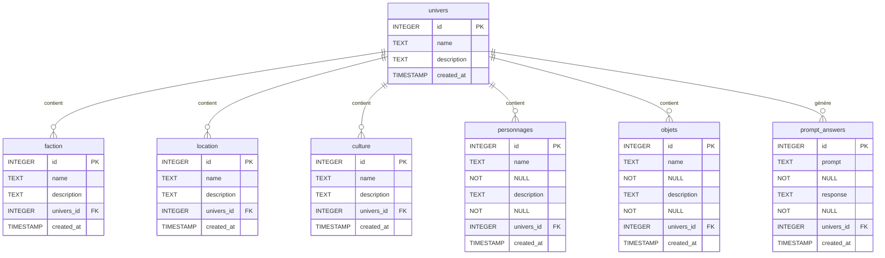
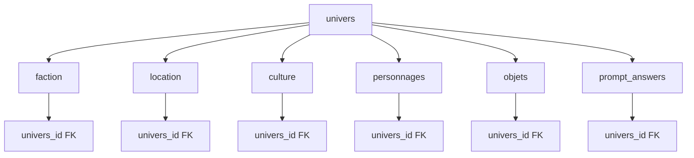
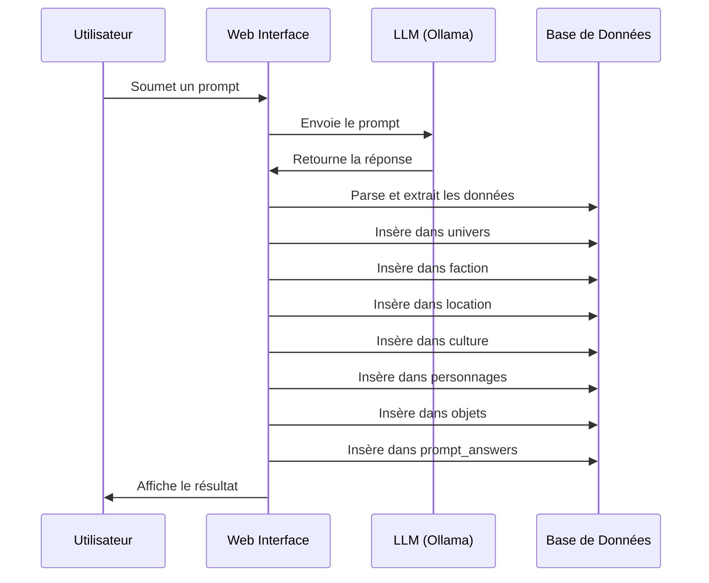

# Wiki - Fictional Universe Builder

## Base de Données - Documentation Complète

### Vue d'ensemble
Le Fictional Universe Builder utilise une base de données SQLite pour stocker tous les contenus générés par l'IA. La structure est hiérarchique avec un univers principal contenant plusieurs entités liées.

### Schéma de la Base de Données



### Détail des Tables

#### 1. Table `univers` (Table Principale)
**Description:** Stocke les informations de base de chaque univers fictif.

| Champ | Type | Contrainte | Description |
|-------|------|------------|-------------|
| `id` | INTEGER | PRIMARY KEY, AUTOINCREMENT | Identifiant unique de l'univers |
| `name` | TEXT | - | Nom de l'univers fictif |
| `description` | TEXT | - | Description détaillée de l'univers |
| `created_at` | TIMESTAMP | - | Date et heure de création |

**Exemple de données:**
```sql
INSERT INTO univers (name, description, created_at) VALUES 
('Cyberpunk 2077', 'Un univers dystopique où la technologie et la cybernétique dominent...', '2024-01-15 10:30:00');
```

#### 2. Table `faction`
**Description:** Stocke les factions politiques, militaires ou sociales dans chaque univers.

| Champ | Type | Contrainte | Description |
|-------|------|------------|-------------|
| `id` | INTEGER | PRIMARY KEY, AUTOINCREMENT | Identifiant unique de la faction |
| `name` | TEXT | - | Nom de la faction |
| `description` | TEXT | - | Description détaillée de la faction |
| `univers_id` | INTEGER | FOREIGN KEY | Référence vers l'univers parent |
| `created_at` | TIMESTAMP | - | Date et heure de création |

**Exemple de données:**
```sql
INSERT INTO faction (name, description, univers_id, created_at) VALUES 
('Arasaka Corporation', 'Une mégacorporation japonaise spécialisée dans la cybernétique...', 1, '2024-01-15 10:35:00');
```

#### 3. Table `location`
**Description:** Stocke les lieux géographiques et les environnements dans chaque univers.

| Champ | Type | Contrainte | Description |
|-------|------|------------|-------------|
| `id` | INTEGER | PRIMARY KEY, AUTOINCREMENT | Identifiant unique du lieu |
| `name` | TEXT | - | Nom du lieu |
| `description` | TEXT | - | Description détaillée du lieu |
| `univers_id` | INTEGER | FOREIGN KEY | Référence vers l'univers parent |
| `created_at` | TIMESTAMP | - | Date et heure de création |

**Exemple de données:**
```sql
INSERT INTO location (name, description, univers_id, created_at) VALUES 
('Night City', 'Une mégalopole futuriste sur la côte ouest américaine...', 1, '2024-01-15 10:40:00');
```

#### 4. Table `culture`
**Description:** Stocke les cultures, traditions et modes de vie dans chaque univers.

| Champ | Type | Contrainte | Description |
|-------|------|------------|-------------|
| `id` | INTEGER | PRIMARY KEY, AUTOINCREMENT | Identifiant unique de la culture |
| `name` | TEXT | - | Nom de la culture |
| `description` | TEXT | - | Description détaillée de la culture |
| `univers_id` | INTEGER | FOREIGN KEY | Référence vers l'univers parent |
| `created_at` | TIMESTAMP | - | Date et heure de création |

**Exemple de données:**
```sql
INSERT INTO culture (name, description, univers_id, created_at) VALUES 
('Street Culture', 'La culture des rues de Night City, dominée par les gangs...', 1, '2024-01-15 10:45:00');
```

#### 5. Table `personnages`
**Description:** Stocke les personnages et personnalités importantes dans chaque univers.

| Champ | Type | Contrainte | Description |
|-------|------|------------|-------------|
| `id` | INTEGER | PRIMARY KEY, AUTOINCREMENT | Identifiant unique du personnage |
| `name` | TEXT | NOT NULL | Nom du personnage |
| `description` | TEXT | NOT NULL | Description détaillée du personnage |
| `univers_id` | INTEGER | FOREIGN KEY | Référence vers l'univers parent |
| `created_at` | TIMESTAMP | - | Date et heure de création |

**Exemple de données:**
```sql
INSERT INTO personnages (name, description, univers_id, created_at) VALUES 
('V', 'Un mercenaire cybernétique cherchant la gloire dans Night City...', 1, '2024-01-15 10:50:00');
```

#### 6. Table `objets`
**Description:** Stocke les objets, armes, technologies et artefacts dans chaque univers.

| Champ | Type | Contrainte | Description |
|-------|------|------------|-------------|
| `id` | INTEGER | PRIMARY KEY, AUTOINCREMENT | Identifiant unique de l'objet |
| `name` | TEXT | NOT NULL | Nom de l'objet |
| `description` | TEXT | NOT NULL | Description détaillée de l'objet |
| `univers_id` | INTEGER | FOREIGN KEY | Référence vers l'univers parent |
| `created_at` | TIMESTAMP | - | Date et heure de création |

**Exemple de données:**
```sql
INSERT INTO objets (name, description, univers_id, created_at) VALUES 
('Sandevistan', 'Un implant cybernétique qui accélère le temps de réaction...', 1, '2024-01-15 10:55:00');
```

#### 7. Table `prompt_answers`
**Description:** Stocke l'historique des interactions entre l'utilisateur et l'IA.

| Champ | Type | Contrainte | Description |
|-------|------|------------|-------------|
| `id` | INTEGER | PRIMARY KEY, AUTOINCREMENT | Identifiant unique de l'interaction |
| `prompt` | TEXT | NOT NULL | Le prompt original de l'utilisateur |
| `response` | TEXT | NOT NULL | La réponse générée par l'IA |
| `univers_id` | INTEGER | FOREIGN KEY | Référence vers l'univers concerné (optionnel) |
| `created_at` | TIMESTAMP | - | Date et heure de l'interaction |

**Exemple de données:**
```sql
INSERT INTO prompt_answers (prompt, response, univers_id, created_at) VALUES 
('Crée un univers cyberpunk', 'Voici un univers cyberpunk détaillé...', 1, '2024-01-15 10:30:00');
```

### Relations entre les Tables



### Flux de Données



### Requêtes SQL Utiles

#### Récupérer un univers complet avec tous ses éléments
```sql
SELECT 
    u.name as universe_name,
    u.description as universe_description,
    f.name as faction_name,
    f.description as faction_description,
    l.name as location_name,
    l.description as location_description,
    c.name as culture_name,
    c.description as culture_description,
    p.name as character_name,
    p.description as character_description,
    o.name as object_name,
    o.description as object_description
FROM univers u
LEFT JOIN faction f ON u.id = f.univers_id
LEFT JOIN location l ON u.id = l.univers_id
LEFT JOIN culture c ON u.id = c.univers_id
LEFT JOIN personnages p ON u.id = p.univers_id
LEFT JOIN objets o ON u.id = o.univers_id
WHERE u.id = ?;
```

#### Compter les éléments par univers
```sql
SELECT 
    u.name as universe_name,
    COUNT(DISTINCT f.id) as faction_count,
    COUNT(DISTINCT l.id) as location_count,
    COUNT(DISTINCT c.id) as culture_count,
    COUNT(DISTINCT p.id) as character_count,
    COUNT(DISTINCT o.id) as object_count
FROM univers u
LEFT JOIN faction f ON u.id = f.univers_id
LEFT JOIN location l ON u.id = l.univers_id
LEFT JOIN culture c ON u.id = c.univers_id
LEFT JOIN personnages p ON u.id = p.univers_id
LEFT JOIN objets o ON u.id = o.univers_id
GROUP BY u.id, u.name;
```

#### Historique des interactions par univers
```sql
SELECT 
    u.name as universe_name,
    pa.prompt,
    pa.response,
    pa.created_at
FROM prompt_answers pa
JOIN univers u ON pa.univers_id = u.id
WHERE pa.univers_id = ?
ORDER BY pa.created_at DESC;
```

### Gestion de la Base de Données

#### Initialisation
```bash
# Dans le conteneur Docker
docker-compose exec web python init_db.py
```

#### Sauvegarde
```bash
# Copier la base de données
cp poc-dockerized/database.db backup_database_$(date +%Y%m%d_%H%M%S).db
```

#### Réinitialisation
```bash
# Supprimer et recréer la base
rm poc-dockerized/database.db
docker-compose exec web python init_db.py
```

### Outils de Documentation

#### Générer un diagramme de la base de données
```bash
# Générer un diagramme Mermaid automatique
docker-compose exec web python generate_db_diagram.py
```

#### Afficher les statistiques de la base de données
```bash
# Générer un rapport complet
docker-compose exec web python db_stats.py
```

### Bonnes Pratiques

1. **Sauvegarde régulière:** Effectuez des sauvegardes quotidiennes de la base de données
2. **Validation des données:** Vérifiez l'intégrité des données après chaque génération
3. **Indexation:** Considérez l'ajout d'index sur les colonnes fréquemment utilisées
4. **Nettoyage:** Supprimez régulièrement les anciennes interactions non liées à un univers

### Évolutions Futures

- Ajout de relations entre personnages
- Système de tags et catégories
- Historique des modifications
- Système de versions pour les univers
- Relations entre factions et locations
- Système de permissions et utilisateurs multiples 